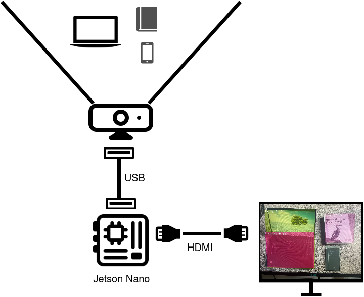

# Kubecon EU 2022 Notes

## Setup and BOM



* Jetson Nano
* USB Webcam (Logitech C930e)
* HDMI Cable
* Monitor
* Keyboard/Mouse

# Kubernetes Setup

* K3s using Docker configured with the Nvidia Runtime:

```json
{
    "default-runtime": "nvidia",
    "runtimes": {
        "nvidia": {
            "path": "nvidia-container-runtime",
            "runtimeArgs": []
        }
    }
}
```

* k3s installed with:

```bash
curl -sfL https://get.k3s.io | INSTALL_K3S_EXEC="--docker --disable servicelb --disable traefik" sh -s -
```

## Application

Kubecon demo was based on the `dustynv/jetson-inference` container image which includes a demo webcam app and pre-trained modes (https://github.com/dusty-nv/jetson-inference)

The Kubecon demo image was tweaked to launch this application on startup with the following Dockerfile:

```dockerfile
FROM dustynv/jetson-inference:r32.7.1

RUN mkdir -p ./data/networks
RUN cd ./data/networks/ && wget https://github.com/dusty-nv/jetson-inference/releases/download/model-mirror-190618/SSD-Mobilenet-v2.tar.gz && tar -zxvf SSD-Mobilenet-v2.tar.gz

CMD /jetson-inference/python/examples/detectnet.py --threshold=0.3 --headless --input-width=1280 --input-height=720 /dev/video0 rtp://192.168.1.218:8888
```

Application launched as a K8s workload. Note the extra mounts

```yaml
apiVersion: apps/v1
kind: Deployment
metadata:
  name: kubecon-demo
  labels:
    app: kubecon-demo
spec:
  selector:
    matchLabels:
      app: kubecon-demo
  replicas: 1
  strategy:
    type: Recreate
  template:
    metadata:
      labels:
        app: kubecon-demo
    spec:
      volumes:
        - name: x11
          hostPath:
            path: /tmp/.X11-unix
            type: Directory
        - name: argus
          hostPath:
            path: /tmp/argus_socket
            type: Socket
        - name: enctune
          hostPath:
            path: /etc/enctune.conf
            type: File
      containers:
        - name: kubecondemo
          image: 'kubecondemo:0.2'
          volumeMounts:
            - name: enctune
              mountPath: /etc/enctune.conf
              subPath: ''
            - name: argus
              mountPath: /tmp/argus_socket
              subPath: ''
            - name: x11
              mountPath: /tmp/.X11-unix/
              subPath: ''
          securityContext:
            privileged: true
```

Once launched, it will take a few minutes to load the pre-trained model and generate the RTP Stream

`GST` then used to view the stream:

```bash
gst-launch-1.0 -v udpsrc port=8888  caps = "application/x-rtp, media=(string)video, clock-rate=(int)90000, encoding-name=(string)H264, payload=(int)96" !  rtph264depay ! decodebin ! videoconvert ! autovideosink
```